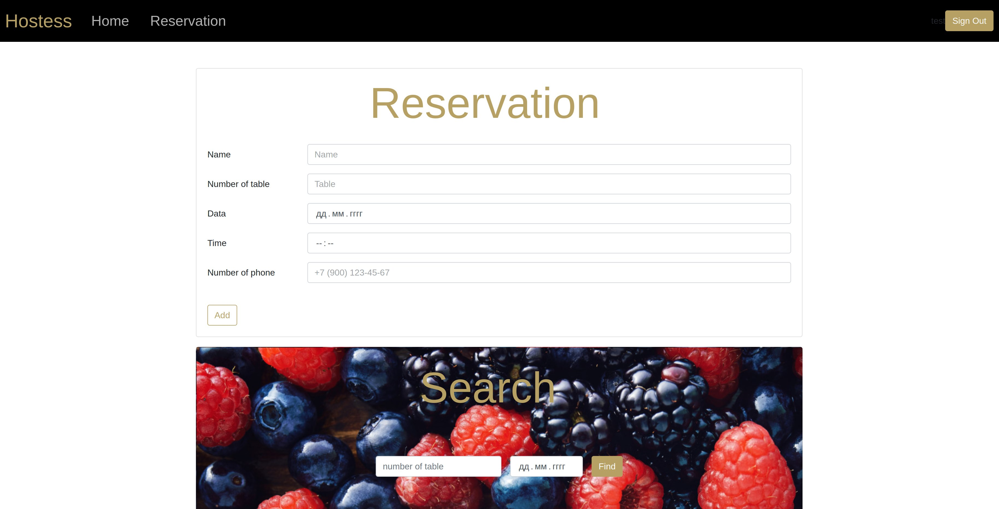
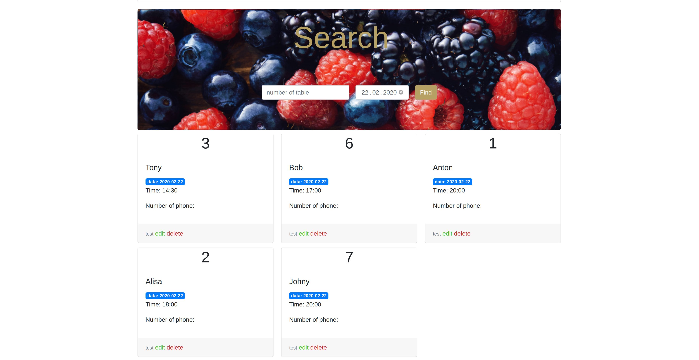

# Hostess
### Final Project of Java Eltex Courses
Web application for restaurant hostess.

This application was created for the restaurant hostess. With it, the hostess can book a table for the visitor.

For ease of use, there are two filters by tables and by date (work together and separately).

### Used technologies:
- Java
- Spring Framework
- PostgreSQL
- Bootstrap
- FreeMarker
- Junit
- more...

Developers Agalakov Anton and Sergeev Artur.
